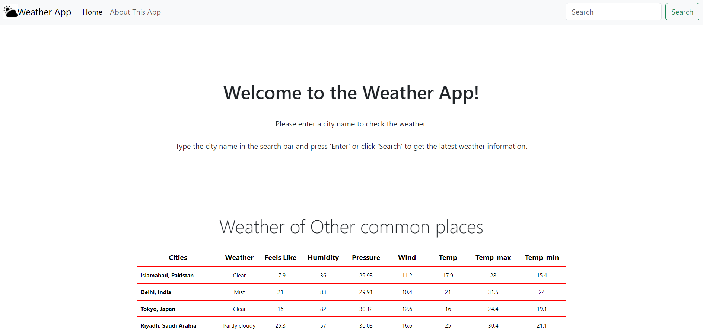

# RealTime Weather App



## Introduction

Welcome to the "RealTime Weather App" – your window to the world's weather. This responsive web application is designed to keep you informed with up-to-the-minute weather updates. It's built with HTML, CSS, Bootstrap, and JavaScript, and seamlessly integrates with a weather API for real-time data.

## Features

- **Responsive Design**: Enjoy a flawless experience on a range of devices, from desktops to mobile phones.

- **Live Weather Data**: Get access to the latest weather information, including temperature, minimum and maximum temperatures, weather conditions, "feels like" temperature, humidity, pressure, wind speed and direction, moonrise, sunrise, and sunset times.

- **User-friendly Interface**: We've prioritized your convenience, ensuring you can access accurate weather data effortlessly.

## Demo

Get a taste of the app's capabilities with this screenshot:


## Usage

1. Open the RealTime Weather App in your web browser.

2. Simply input the location you want to check the weather for.

3. Watch as the app provides you with detailed real-time weather information to help you plan your day effectively.

## Installation

To run the RealTime Weather App locally, follow these simple steps:

1. Clone this repository:
   ```shell
   git clone https://github.com/iMamoonAkhter/RealTime-Weather-App.git
